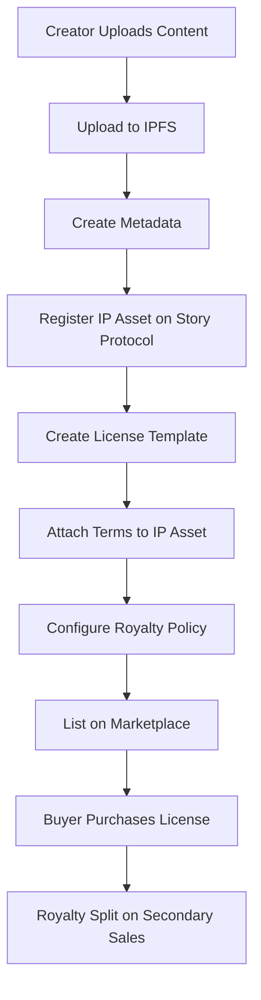

# Mint2Story - Transform Social Media Into Digital Assets

> **Empowering creators to own, license, and monetize their social media content as programmable IP assets on the blockchain.**

[](https://www.storyprotocol.xyz/)
[](https://nft.storage/)
[](https://react.dev/)
[](https://www.typescriptlang.org/)

## 🎯 Vision

Mint2Story revolutionizes how creators monetize their social media content by transforming posts, photos, and videos into tradeable, licensable digital assets. We're building the infrastructure for the creator economy 2.0 - where every viral post, memorable moment, and creative work becomes a programmable IP asset with built-in licensing and royalty mechanisms.

## 🚀 Key Features

### 🎨 Content Minting
- **One-Click Minting**: Transform Instagram, Twitter, or TikTok posts into NFTs
- **Batch Processing**: Mint multiple assets simultaneously
- **Metadata Preservation**: Capture original post data, timestamps, and engagement metrics
- **Multi-Media Support**: Images, videos, carousels, and stories

### 📜 IP Licensing & Royalties
- **Story Protocol Integration**: Industry-standard programmable IP framework
- **Flexible License Templates**: Commercial use, editorial, personal, derivative works
- **Automated Royalty Distribution**: Smart contract-powered revenue sharing
- **Rights Attestation**: Cryptographic proof of content ownership

### 🏪 Marketplace
- **Discover & Browse**: Search assets by creator, platform, license type, or price
- **Advanced Filtering**: Sort by date, popularity, license terms, royalty rates
- **License Purchase**: Acquire usage rights with transparent terms
- **Creator Profiles**: Showcase portfolios and track sales

### 👤 Creator Dashboard
- **Portfolio Management**: View all minted assets in one place
- **Analytics**: Track views, sales, and revenue
- **Royalty Tracking**: Real-time earnings from secondary sales
- **License Management**: Monitor active licenses and usage

## 🛠 Technology Stack

### Frontend
- **React 18.3** - Modern UI framework with hooks and concurrent features
- **TypeScript** - Type-safe development
- **Vite** - Lightning-fast build tool and dev server
- **Tailwind CSS** - Utility-first styling with custom design system
- **shadcn/ui** - Beautiful, accessible component library
- **React Router** - Client-side routing
- **TanStack Query** - Server state management

### Web3 Infrastructure
- **Story Protocol Core SDK** - Programmable IP framework
  - IP Asset Registration
  - License Template Creation
  - Terms Attachment
  - Royalty Configuration
- **wagmi** - React hooks for Ethereum
- **viem** - TypeScript interface for Ethereum
- **Web3Modal** - Wallet connection UI
- **nft.storage (IPFS)** - Decentralized file storage

### Backend (Lovable Cloud)
- **Supabase** - PostgreSQL database, authentication, and storage
- **Edge Functions** - Serverless API endpoints
- **Row Level Security** - Database-level access control
- **Realtime** - Live data synchronization

## 📦 Installation & Setup

### Prerequisites
- Node.js 18+ and npm
- Git
- A Web3 wallet (MetaMask, WalletConnect, etc.)
- NFT.Storage API key (free at [nft.storage](https://nft.storage))

### Quick Start

```bash
# Clone the repository
git clone https://github.com/yourusername/mint2story.git
cd mint2story

# Install dependencies
npm install

# Configure environment variables
cp .env.example .env
# Edit .env and add your NFT_STORAGE_KEY

# Start development server
npm run dev
```

### Environment Variables

```env
# NFT.Storage API Key (required for IPFS uploads)
VITE_NFT_STORAGE_KEY=your_nft_storage_api_key_here

# Lovable Cloud / Supabase (auto-configured)
VITE_SUPABASE_URL=auto_generated
VITE_SUPABASE_PUBLISHABLE_KEY=auto_generated
VITE_SUPABASE_PROJECT_ID=auto_generated
```

## 🎭 Story Protocol Integration

### Core Concepts

Mint2Story leverages Story Protocol to create **programmable IP assets** with built-in licensing and royalty mechanisms. Every minted social media post becomes an IP Asset on the Story Protocol network.

### Integration Flow



### Key Components

#### 1. IP Asset Registration
```typescript
// src/utils/story.ts
export async function registerIPAsset(params: {
  nftContract: string;
  tokenId: string;
  metadataURI: string;
  metadataHash: string;
}) {
  const client = createStoryClient();
  
  const response = await client.ipAsset.register({
    nftContract: params.nftContract,
    tokenId: BigInt(params.tokenId),
    metadata: {
      metadataURI: params.metadataURI,
      metadataHash: params.metadataHash,
      nftMetadataHash: params.metadataHash,
    },
    txOptions: { waitForTransaction: true }
  });
  
  return response;
}
```

#### 2. License Template Creation
```typescript
export async function createLicenseTemplate(params: {
  name: string;
  commercialUse: boolean;
  derivativesAllowed: boolean;
  royaltyPercentage: number;
}) {
  const client = createStoryClient();
  
  const response = await client.license.createLicenseTerms({
    terms: {
      transferable: true,
      commercialUse: params.commercialUse,
      derivativesAllowed: params.derivativesAllowed,
      royaltyPolicy: params.royaltyPercentage > 0 ? "0x..." : undefined,
    },
    txOptions: { waitForTransaction: true }
  });
  
  return response;
}
```

#### 3. Royalty Configuration
```typescript
export async function setRoyaltyPolicy(params: {
  ipId: string;
  royaltyPercentage: number;
  recipients: string[];
  splits: number[];
}) {
  const client = createStoryClient();
  
  const response = await client.royalty.setRoyaltyPolicy({
    ipId: params.ipId,
    royaltyPolicy: "0x...", // Royalty policy contract address
    percentage: params.royaltyPercentage * 100, // Convert to basis points
    recipients: params.recipients,
    splits: params.splits,
    txOptions: { waitForTransaction: true }
  });
  
  return response;
}
```

### Metadata Schema

Mint2Story uses a custom metadata schema that extends the Story Protocol standard:

```typescript
interface MintMyStoryMetadata {
  schema_version: "1.0.0";
  title: string;
  description: string;
  
  creator: {
    handle: string;        // @username
    wallet: string;        // Ethereum address
  };
  
  source: {
    platform: "instagram" | "twitter" | "tiktok";
    post_id: string;
    permalink: string;
    timestamp: string;     // ISO 8601
  };
  
  media: Array<{
    type: "image" | "video";
    uri: string;           // ipfs://...
  }>;
  
  rights_attestation: {
    text: string;          // "I attest that I own the rights..."
    signature: string;     // Cryptographic signature
    signed_at: string;     // ISO 8601
  };
  
  license_templates: Array<{
    id: string;
    name: string;
    commercial_use: boolean;
    derivatives_allowed: boolean;
    price: string;         // In ETH
  }>;
  
  royalties: Array<{
    recipient: string;     // Ethereum address
    percentage: number;    // 0-100
  }>;
}
```

## 📁 Project Structure

```
mint2story/
├── src/
│   ├── components/          # React components
│   │   ├── ui/             # shadcn/ui components
│   │   ├── Hero.tsx        # Landing page hero
│   │   ├── Navigation.tsx  # Header navigation
│   │   ├── FilterSheet.tsx # Marketplace filters
│   │   └── LicenseDialog.tsx # License purchase dialog
│   ├── pages/              # Page components
│   │   ├── Index.tsx       # Landing page
│   │   ├── Marketplace.tsx # Marketplace browse
│   │   ├── Dashboard.tsx   # Creator dashboard
│   │   └── HowItWorksPage.tsx # Onboarding
│   ├── utils/              # Utility functions
│   │   ├── ipfs.ts         # IPFS upload utilities
│   │   ├── story.ts        # Story Protocol SDK wrapper
│   │   └── ipfs.examples.ts # Example usage
│   ├── config/             # Configuration
│   │   └── web3.ts         # Web3 setup (chains, wallets)
│   ├── integrations/       # External integrations
│   │   └── supabase/       # Supabase client & types
│   └── hooks/              # Custom React hooks
├── pages/api/              # Serverless API routes
│   ├── register.ts         # Register IP asset
│   ├── createTerms.ts      # Create license terms
│   ├── attachTerms.ts      # Attach terms to IP
│   └── setRoyalty.ts       # Configure royalties
├── supabase/               # Database & backend
│   └── functions/          # Edge functions
├── docs/                   # Documentation
│   ├── IPFS_README.md      # IPFS integration guide
│   └── PITCH.md            # Investor pitch
└── public/                 # Static assets
```

## 🔒 Security & Best Practices

### IPFS Upload Security
- **Client-side validation**: Check file types and sizes before upload
- **Rate limiting**: Implement upload throttling to prevent abuse
- **Error handling**: Graceful fallbacks for failed uploads
- **Data integrity**: Store IPFS hashes on-chain for verification

### Smart Contract Interaction
- **Transaction simulation**: Preview gas costs before execution
- **User confirmation**: Clear dialogs for wallet interactions
- **Error messages**: Human-readable feedback for failures
- **Retry logic**: Handle network congestion gracefully

### Authentication & Authorization
- **Wallet-based auth**: No passwords, just cryptographic signatures
- **Row-level security**: Database policies enforce access control
- **API key protection**: Environment variables, never committed
- **CORS configuration**: Restrict API access to known domains

## 📊 Roadmap

### Phase 1: MVP (Current)
- [x] Basic UI and navigation
- [x] IPFS integration for media storage
- [x] Story Protocol IP asset registration
- [x] Marketplace browsing
- [x] License dialog and filtering
- [ ] Wallet connection
- [ ] Content minting flow
- [ ] License purchase

### Phase 2: Enhanced Features (Q2 2025)
- [ ] Social media OAuth integration (Instagram, Twitter)
- [ ] Automated content scraping
- [ ] Batch minting
- [ ] Advanced analytics dashboard
- [ ] Mobile responsive design
- [ ] Creator verification system

### Phase 3: Marketplace Expansion (Q3 2025)
- [ ] Auction functionality
- [ ] Bundle sales (collections)
- [ ] Offers and negotiations
- [ ] Trending algorithm
- [ ] Recommendation engine
- [ ] Social features (likes, shares, comments)

### Phase 4: Platform Growth (Q4 2025)
- [ ] White-label solutions for brands
- [ ] API for third-party integrations
- [ ] Mobile apps (iOS, Android)
- [ ] Multi-chain support
- [ ] Fiat on-ramps
- [ ] Creator grants program

## 🤝 Contributing

We welcome contributions! Please see our [Contributing Guide](CONTRIBUTING.md) for details.

### Development Workflow
1. Fork the repository
2. Create a feature branch (`git checkout -b feature/amazing-feature`)
3. Commit your changes (`git commit -m 'Add amazing feature'`)
4. Push to the branch (`git push origin feature/amazing-feature`)
5. Open a Pull Request

## 📄 License

This project is licensed under the MIT License - see the [LICENSE](LICENSE) file for details.

## 🔗 Links

- **Website**: [mint2story.com](https://mint2story.com)
- **Documentation**: [docs.mint2story.com](https://docs.mint2story.com)
- **Twitter**: [@mint2story](https://twitter.com/mint2story)
- **Discord**: [Join our community](https://discord.gg/mint2story)
- **Story Protocol**: [storyprotocol.xyz](https://www.storyprotocol.xyz/)

## 💬 Support

- **Discord**: [Community server](https://discord.gg/mint2story)
- **Email**: support@mint2story.com
- **GitHub Issues**: [Report bugs](https://github.com/yourusername/mint2story/issues)

## 🙏 Acknowledgments

- Story Protocol team for the programmable IP infrastructure
- NFT.Storage for decentralized file storage
- Lovable for the development platform
- The Web3 creator community for inspiration

---

Built with ❤️ by creators, for creators.
